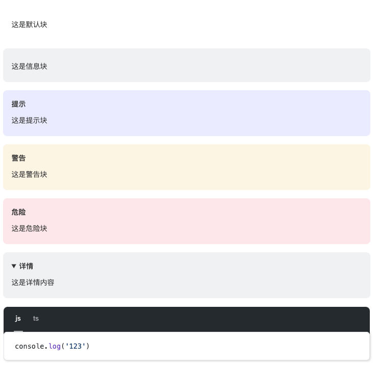

# remark-block-containers

<div align="center">

[](https://www.npmjs.com/package/remark-block-containers)
[](https://www.npmjs.com/package/remark-block-containers)
[](https://bundlephobia.com/result?p=remark-block-containers)

English · [中文](./README-zh_CN.md)

This is a remark plugin for creating custom containers that allow the addition of titles, IDs, or style classes.
</div>

## ❓When to use?

If you want to add custom containers in Markdown, such as generating warning, details, danger, or tip boxes.

- Allows customization of tag types
- Allows adding IDs or style classes
- Allows customization of tag titles
- Built-in shortcuts for info, tip, warning, danger, details, code-group, etc.

## 📦 Installation

This package only works with ESM. Node.js version 14.14+

```bash
npm install remark-block-containers
```
or
```bash
yarn add remark-block-containers
```
or
```bash
pnpm add remark-block-containers
```

## 📄 Usage

`::: [type][{id|class}] [title]`

Suppose you have the following Markdown file, `example.md`, which contains a flexible container of type "tip". 
Note: Each container must start and end with three colons, and *there must be a blank line between two adjacent containers*.

```markdown
<!-- Must have a blank line -->
::: tip 提示
这是一条提示。
:::
<!-- Must have a blank line -->
```

And you have an `example.js` file that includes:

```javascript
import { unified } from 'unified'
import { read } from 'to-vfile'
import remarkParse from 'remark-parse'
import remarkRehype from 'remark-rehype'
import rehypeStringify from 'rehype-stringify'
import rehypeFormat from 'rehype-format'
import remarkBlockContainers from 'remark-block-containers'

const file = await unified()
  .use(remarkParse)
  .use(remarkBlockContainers)
  .use(remarkRehype)
  .use(rehypeFormat)
  .use(rehypeStringify)
  .process(await read('example.md'))

console.log(String(file))
```

Running `node example.js` will produce the following output👇

```html
<div class="block-default tip">
  <p class="block-title">提示</p>
  <p>这是一条提示。</p>
</div>
```

> `info`、`tip`、`warning`、`danger`、`details`、`code-group` are built-in shortcuts and are equivalent to `::: p{.tip}`。
>
> If you want to add a **custom ID**, use `::: p{#id}`.
>
> Therefore, it is allowed to customize any container as long as the `type` is a valid tag type, such as `div`, `main`, `span`, etc.

### Optional Styles

**By default, all containers have no style**, so **you can set container styles yourself** or **use preset styles**:

```javascript
// 引入预设样式表
import 'remark-block-containers/css'
```



### Code Group

When using `code-group`, simply referencing this plugin is not enough to implement the switching logic. It requires importing `useCodeGroups.js` at the appropriate location and executing the `useCodeGroups` method to listen for code group `tab` clicks and implement the switching logic.

```javascript
import { useCodeGroups } from 'remark-block-containers/useCodeGroups'
useCodeGroups()
```

### ❗ Important Notes

Currently, there is an issue where a container with no content is mistakenly interpreted as a non-container, so it is best to avoid this practice.

```markdown
:::
:::
```

## ⚙️ Options

All options are optional.

```javascript
use(remarkBlockContainers, {
  containerClass: 'block-default', // Default container style class
  containerType: 'div', // Container tag type, only affects shortcuts.
  titleType: 'p', // Title tag type
  titleClass: 'block-title', // Default title style class
})
```

You can also use the default options directly

```javascript
use(remarkBlockContainers)
```

## License

[MIT](https://github.com/leezhian/remark-block-containers) © [leezhian](https://github.com/leezhian)